# CMPE 172 - Lab #9 Spring RabbitMQ Notes

In this Lab, we experimented with Spring AMQP Messaging using RabbitMQ. We deployed a simple one node RabbitMQ on Docker and tested the code locally.

---

## Messaging with RabbitMQ

For Part I of the lab, we created a RabbitMQ Message Receiver and registered the listener to send a message by using Spring AMQP’s RabbitTemplate. 

In addition to this we had to: 

1. Configure a message listener container.
2. Declare the queue, the exchange, and the binding between them.
3. Configure a component to send some messages to test the listener.


We created a Runner class to test the message and configured the application.properties file to 

```
spring.rabbitmq.host=localhost
spring.rabbitmq.port=5672
spring.rabbitmq.username=guest
spring.rabbitmq.password=guest
```

* Screenshot of Docker network creation

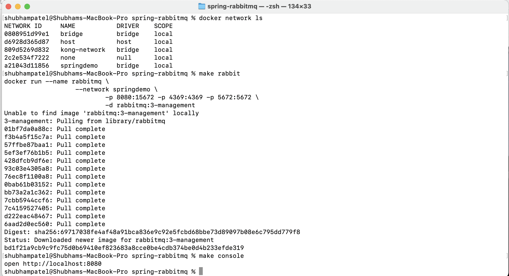

<br>

* Screenshot of command line output of sending and receiving messages for "Messaging with RabbitMQ"

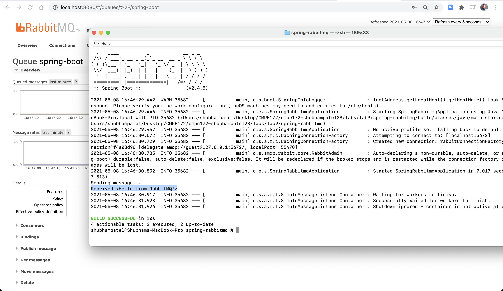

---

## RabbitMQ Tutorial - Hello World

For Part II of the lab, we tested sending and receving "Hello World!" messages using RabbitMQ console. We wrote two programs using the spring-amqp library; a producer that sends a single message, and a consumer that receives messages and prints them out.

We ran the application using 

```
jar:
	gradle bootJar

send: jar
	java -jar build/libs/spring-rabbitmq-helloworld-1.0.jar \
	--spring.profiles.active=$(env),hello,sender

receive: jar
	java -jar build/libs/spring-rabbitmq-helloworld-1.0.jar \
	--spring.profiles.active=$(env),hello,receiver
```

* Screenshot of command line output of sending messages for "RabbitMQ Tutorial - Hello World"

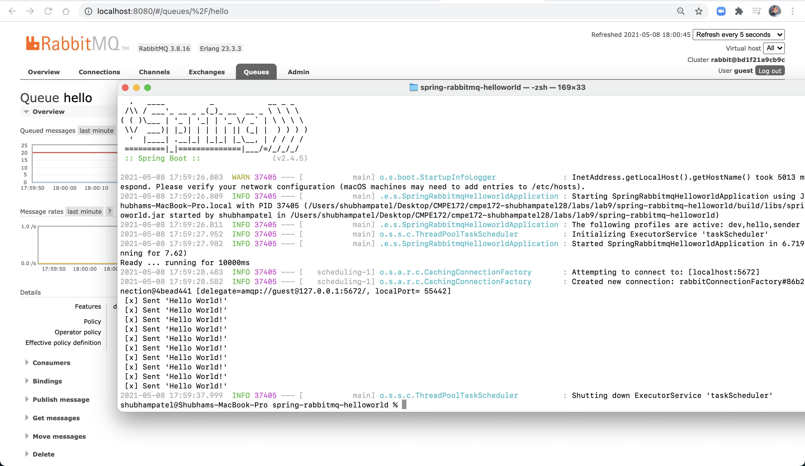

<br>

* Screenshots of RabbitMQ Console with a sample of getting one message from the Queue for "RabbitMQ Tutorial - Hello World." (Note that in the second screenshot the number is reduced by 1.)

I accidentally ran the send command twice and so it sent 20 messages. 

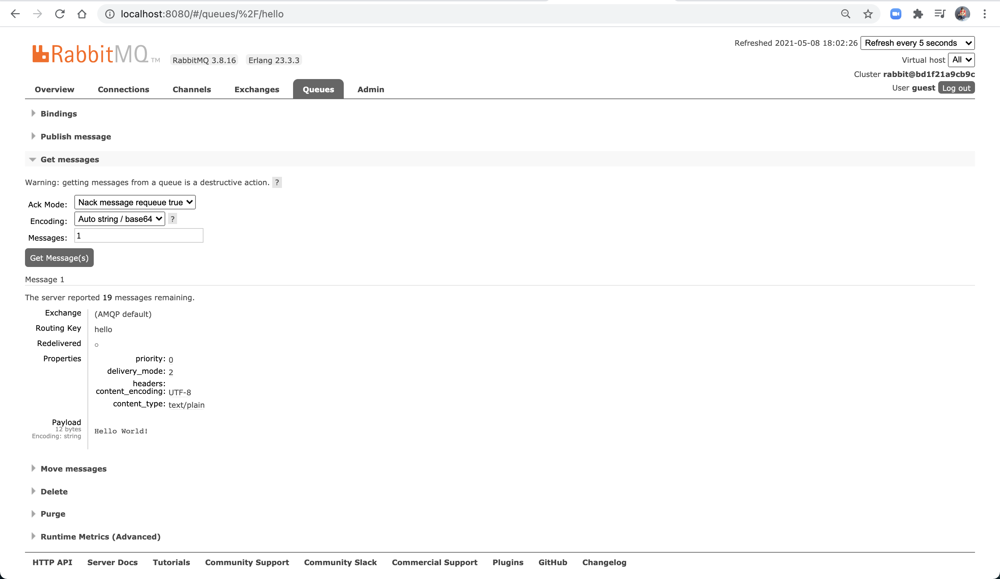

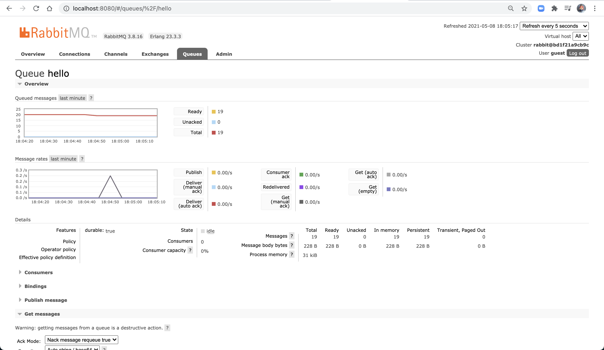


<br>

* Screenshots of command line output of receving messages for "RabbitMQ Tutorial - Hello World" (Note that after receive all the messages are removed from the queue)

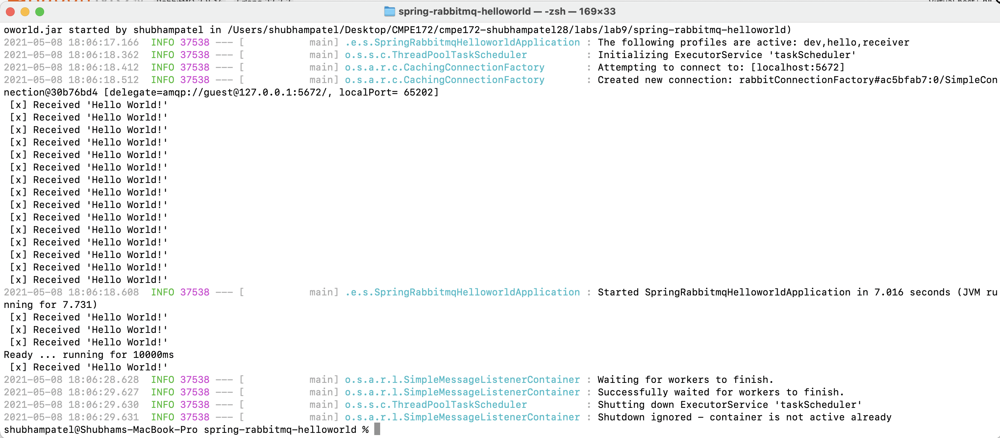

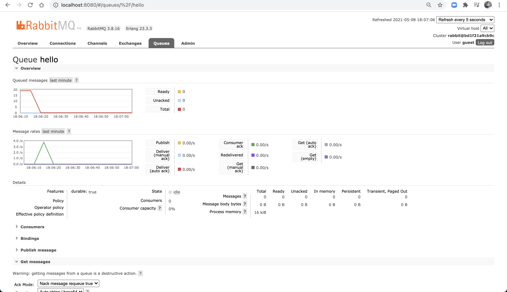

---

## RabbitMQ Tutorial - Work Queues

For Part III of the lab, we created a Work Queue that will be used to distribute time-consuming tasks among multiple workers.

I had few challenges while working on this part. I followed the instructions and also referred to the refereces given to run the application. However, it didn't proceed ahead and if it did it gave frame omitted error.

* Screenshots of command line output of sending messages for "RabbitMQ Tutorial - Work Queues"

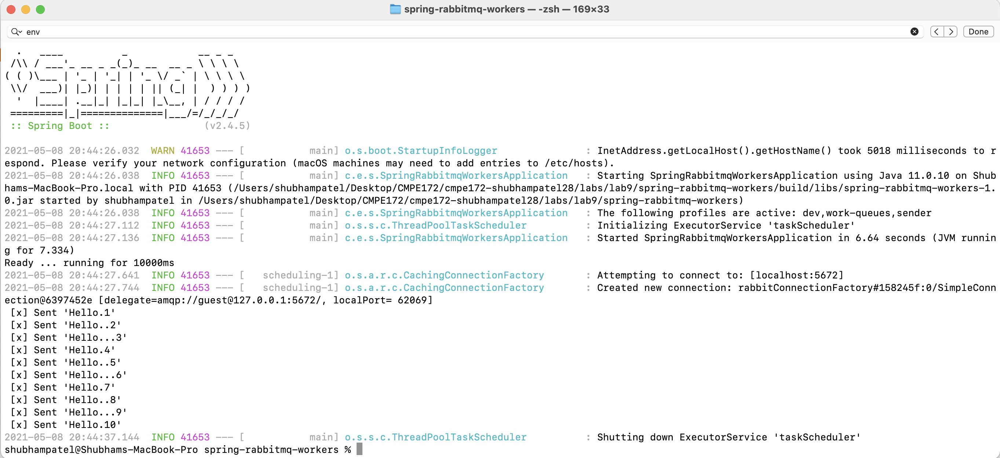


<br>

* Screenshots of RabbitMQ Console with a sample of getting one message from the Queue for "RabbitMQ Tutorial - Work Queues" (Note the number of messages getting decreased in second screenshot)

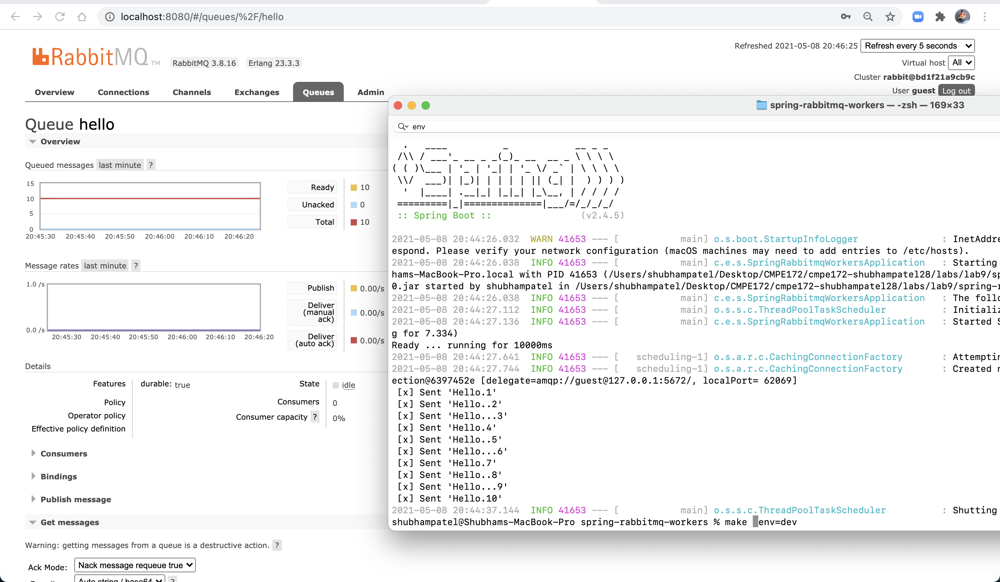

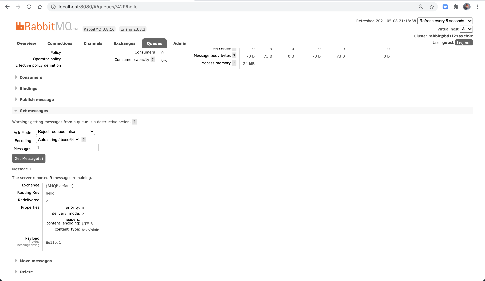


<br>

* Screenshots of command line output of receving messages for "RabbitMQ Tutorial - Work Queues" (Note receive updated in RabbitMQ console)

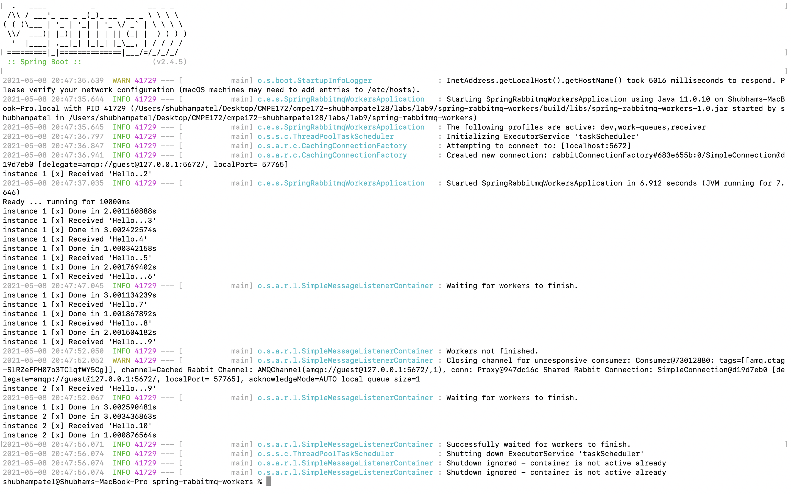

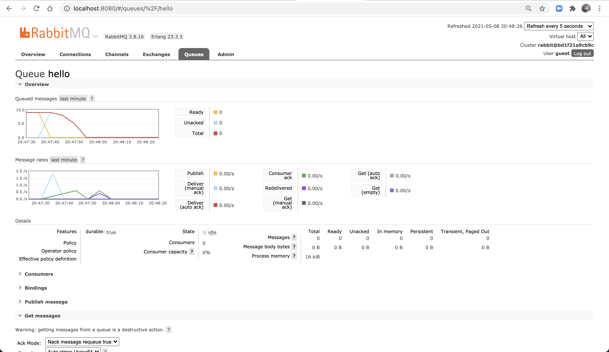

---

Profiles in Spring allows us to map the beans to different profiles. We can also use the environment variables to define which profiles are active. We can incorporate this into our team project by defining active starbucks user profiles. We can also deal with activating user profiles in our application interface. 

We can use RabbitMQ in our Starbucks team project and set up the server to pass messages between to our clients. This can be messages related to their order, card, or rewards. Using AQMP, we can integrate it between frontend and backend that can allows us to consume messsages in case of server error and process those orders/messages.  


# rabbitmq-messaging
